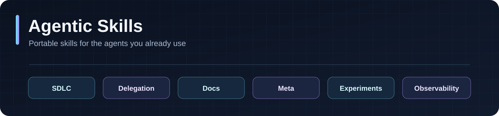

<p align="center"></p>
<p align="center"></p>

# Agentic Skills

[](https://github.com/AgentParadise/agentic-skills/actions/workflows/ci.yml)
[](LICENSE)
[](#install-from-github)

Portable skills for Claude Code, Codex, Gemini CLI, and other agents supported by [Vercel Skills](https://github.com/vercel-labs/skills). Install one skill, a whole module, or choose from the full catalog. No build required.

[Claude Code](#claude-code) · [Codex](#codex) · [Collections](#collections)

## Install from GitHub

Browse and choose interactively:

```bash
npx skills add AgentParadise/agentic-skills
```

### Claude Code

```bash
npx skills add AgentParadise/agentic-skills --skill review -a claude-code
```

### Codex

```bash
npx skills add AgentParadise/agentic-skills --skill review -a codex
```

### Whole collection

Install all SDLC skills into Claude Code from the online folder:

```bash
npx skills add https://github.com/AgentParadise/agentic-skills/tree/main/skills/sdlc --skill '*' -a claude-code -y
```

Replace `sdlc` with a collection below and `claude-code` with `codex`, `gemini-cli`, or another [supported agent](https://github.com/vercel-labs/skills#supported-agents). Add `-g` for installation across projects. Use `--list` to preview without installing.

The repository is currently private, so you need Git, GitHub CLI, or SSH access to install from GitHub.

## Collections

Collections are folders, not separate packages. Vercel Skills discovers each `SKILL.md` directly from the selected folder. Every skill can also be installed individually with `--skill <name>`.

| Collection | Focus | Included skills |
| --- | --- | --- |
| [SDLC](skills/sdlc) | Git, QA, configuration, security | [browser](skills/sdlc/browser), [centralized-configuration](skills/sdlc/centralized-configuration), [commit](skills/sdlc/commit), [env-management](skills/sdlc/env-management), [git](skills/sdlc/git), [git-worktree](skills/sdlc/git-worktree), [macos-keychain-secrets](skills/sdlc/macos-keychain-secrets), [pre-commit-qa](skills/sdlc/pre-commit-qa), [prioritize](skills/sdlc/prioritize), [qa-setup](skills/sdlc/qa-setup), [review](skills/sdlc/review), [security-hardening](skills/sdlc/security-hardening), [testing-expert](skills/sdlc/testing-expert) |
| [Delegation](skills/delegation) | Agent handoffs | [delegating-to-claude-p](skills/delegation/delegating-to-claude-p), [delegating-to-codex](skills/delegation/delegating-to-codex), [writing-handoffs](skills/delegation/writing-handoffs) |
| [Docs](skills/docs) | Guides and diagrams | [fuma](skills/docs/fuma), [html-guide](skills/docs/html-guide), [system-infographic](skills/docs/system-infographic) |
| [Meta](skills/meta) | Skill and agent instruction design | [authoring-agents-md](skills/meta/authoring-agents-md), [authoring-skills](skills/meta/authoring-skills), [skill-testing](skills/meta/skill-testing) |
| [Experiments](skills/experiments) | Hypothesis-driven experiments | [running-experiments](skills/experiments/running-experiments) |
| [Observability](skills/observability) | Langfuse learning loops | [langfuse-learning-loops](skills/observability/langfuse-learning-loops) |

For example, preview a collection online without installing:

```bash
npx skills add https://github.com/AgentParadise/agentic-skills/tree/main/skills/delegation --list
```

```text
skills/<module>/<skill>/SKILL.md
skills/<module>/<skill>/scripts/       # optional
skills/<module>/<skill>/references/    # optional
```

The skills came from Agentic Primitives. Workspace runtime and exporter tooling live in [Agentic Workspace](https://github.com/AgentParadise/agentic-workspace). See [AGENTS.md](AGENTS.md) for authoring rules. MIT licensed.

## Language breakdown

This is a Markdown-first skill catalog, not an HTML application. The HTML files are real templates bundled with documentation skills. GitHub normally excludes Markdown from its language chart, so this repository explicitly includes its Markdown source there. The prior Rust collection installer was removed in favor of Vercel Skills.
